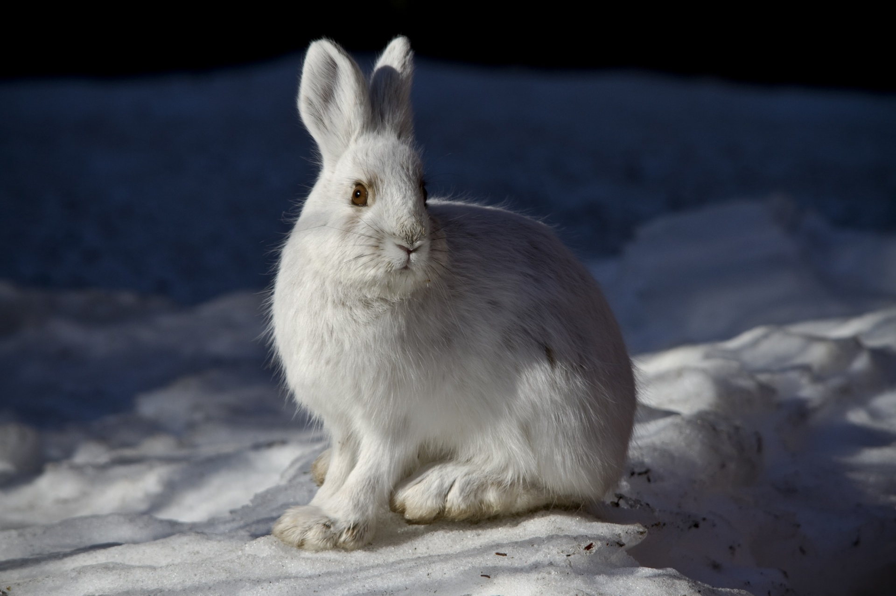

```{r setup, include=FALSE}
knitr::opts_chunk$set(echo = TRUE, message = F, warning = F)
```


```{r, message=FALSE, warning=FALSE}
#Loading the packages and the data that will be needed for this assignment.

library(tidyverse)
library(tidyr)
library(RColorBrewer)
library(here)
library(kableExtra)
library(knitr)
library(janitor)
library(sf)
library(tmap)
library(jpeg)
#these are all of the packages that I think I might need for this project

hare <- read_csv(here("data", "showshoe_lter.csv")) #this is the raw data that is going to be used in this study.

```

*Task 1*
Showshoe Hares

1. Description of the project:
The data used in this analysis was collected from Bonanza Creek Experimental Forest between 1999 to 2017. The purpose of the study was to collect physical and population data about snowshow hares in the study area. dThis analysis done in this markdown document is to check the relationship between a snowshoe hares weight and hind foot measurement. 

2. Pictures of a Snowshoe hare:

```{r, warnings=F}
#This code chuck is to upload a picture of a snowshoe hare.

 #using the knitr package to include the picture of the snowshoe hare
```

**Figure 1. Snowshoe Hare.** A snowshoe hare in the snow. Citation: Portrait of a Wild Snowshoe Hare, accessed 2/5/2020, <https://www.publicdomainpictures.net/en/view-image.php?image=212388&picture=snowshoe-hare>


3. Data Wrangling and Visualization

```{r, message=FALSE, warning=F}
#Data Wrangling for the graph

#This first step is to make the data a more usable and understandable format. For this project that mostly means dropping unneccessary columns and dropping NA values. 
hare_tidy <- hare %>%
  select(-time, -notes) %>% #This is removing the time, notes and study columns from the analysis
  filter(sex != "?", sex != "F?", sex != "M?", sex != "pf") %>% # this is removing the data entries that are unclear about the hare's sex
  mutate(
    sex = case_when(
      sex == "f" ~ "F",
      sex == "m" ~ "M"
    )
  ) %>%# This is making all of the males and female the same variables
  filter(sex != "NA", hindft != "NA" ) #this is removing the NA values from the sex column and the NA values from hindft


```

```{r}
#Creating a histogram of the hare weight distribution
hare_hist <- ggplot(data = hare_tidy, aes(x= weight)) +
  geom_histogram() #this is checking how distributed the weight of the hares is spread 

hare_hist
#The weights of the hares appear to be normaly distributed.
```

**Figure 2. Exploratory Histogram of Snowshoe Hare Weights** The distribution of weights of the snowshoe hares appears to be pretty normally distributed.

```{r, message=FALSE, warning=F}
#Graph Visualization


hare_graph <- ggplot(data = hare_tidy, aes(x = weight, y = hindft)) + #This graph is going to explore the relationship between weight and the measure of the hare's hindfeet length.
  geom_point(aes(color=sex)) + #this is setting the for each sex variable
  facet_wrap("sex") + #This is creating to graphs, one for each sex
  theme_bw() +
  xlab("Weight (grams)") +
  ylab("Hind Foot")+
  ggtitle("Snowshoe Hare Weights Compared to Hind Foot")
  

hare_graph
#As the hares weight increases the size of their hind feet also increases. There does not seem to be a difference between this trend appears to be the same for both male and female hares

```

**Figure 3. Graph Comparing Snowshoe Hare Weights With Hind Foot Measurements**. There appears to be a positive correlation between a snowshoe hare's weight with its hind foot measurement. This appears to be true for both males and females.

```{r}
#Data wrangling for the table

hare_summary <- hare_tidy %>%
  group_by(study, sex) %>%
  summarize(
    mean_weight = mean(weight, na.rm = TRUE),
    mean_hindft = mean(hindft, na.rm = TRUE),
    sample_size = length(weight)
  ) #this has created a summary of the tidy data which has calculated the mean weight and hind foot measurement for each study site of and each sex for the study
  
```

**Table 1. Summary Table of Hare Weight and Hind Foot Measurements.** The average weight weights and hind foot measurements appear to be fairly consistent in all studies done on snowshoe hares. The study with the largest sample size was the population study.
```{r, message=FALSE, warning=F}
#Data Table

hare_table <- kable(hare_summary, 
                    col.names = c("Study", "Sex", "Average Weight (g)", "Average Hind Foot", "Sample Size")) %>% #This has renamed the columns in the table
  kable_styling(bootstrap_options = "striped", 
                full_width = F) #This is making the table look more professional.


hare_table
```