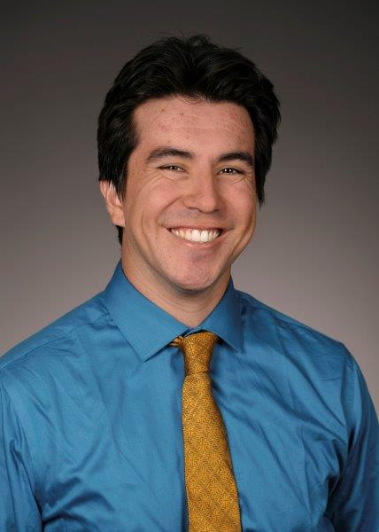

```{r setup, include=FALSE}
knitr::opts_chunk$set(echo = TRUE)
```

```{r, echo=FALSE, message=FALSE, warning=FALSE}
library(knitr)
#image of me



```


Biography:
Robert Saldivar is currently a second year Master's student at the Bren School of Environmental Science and Management at University of California, Santa Barbara. Robert is studying Conservation Planning and Enironmental Data Science.


[LinkedIn](https://www.linkedin.com/in/robert-saldivar-154a922b/)

[GitHub](https://github.com/robertsaldivar)

[Resume](https://robertsaldivar.github.io/Saldivar_Website/resume)