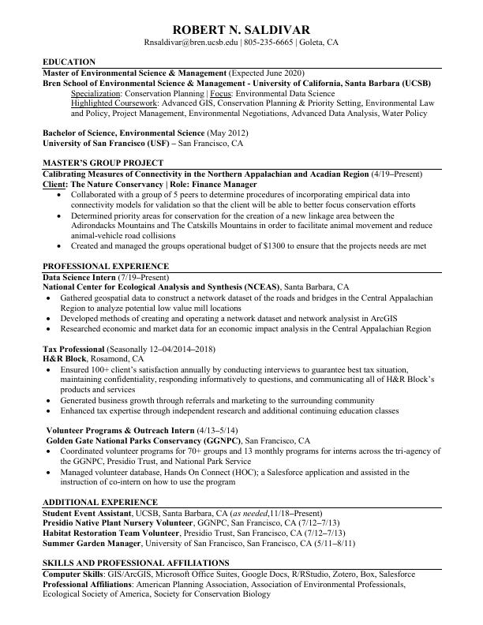

```{r setup, include=FALSE}
knitr::opts_chunk$set(echo = TRUE)
```

```{r, include=FALSE}
library(knitr)
library(pdftools)


pdftools::pdf_convert("resume.pdf", format = "jpg")


```

```{r, echo=FALSE, message=FALSE, warning=FALSE}



```


